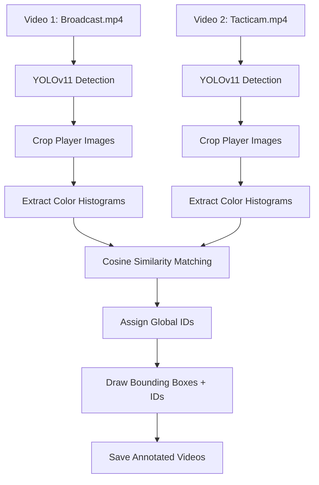

#  Cross-Camera Player Re-Identification

##  Overview
This project enables **consistent player identification across two different video feeds** (such as _broadcast_ and _tacticam_) of the same sporting event.

Leveraging a fine-tuned YOLOv11 model, the system **detects, matches, and tracks** players, so each individual is labeled with the same ID in both videos — no matter the camera angle.

---

## Features

-  Automatic **player detection** in both videos using YOLOv11  
-  **Tracking** individual players frame-by-frame  
-  **Visual appearance matching** using color histograms  
-  **Consistent player IDs** across both videos  
-  **Modular code**, ready for plug-in of jersey recognition, face matching, or deep re-ID models  

---

##  Demo Output

Annotated videos saved to your **Google Drive**:

- `final_annotated_broadcast.mp4`
- `final_annotated_tacticam.mp4`

 In both videos, each player's ID appears clearly **above their head** and remains consistent across views.

---

##  Requirements

<details>
<summary>Python Dependencies</summary>

```bash
Python 3.8+
ultralytics
opencv-python-headless
torchvision
scikit-learn
numpy
```
</details>

<details>
<summary>Recommended Environment</summary>

-  Google Colab  
-  Google Drive for input/output  
</details>

---

##  Installation

### 1. Install dependencies (in Colab)
```python
!pip install ultralytics opencv-python-headless torchvision scikit-learn numpy
```

### 2. Mount Google Drive
```python
from google.colab import drive
drive.mount('/content/drive')
```

---

##  Usage

### Prepare your files:
Place these in your Google Drive:
-  `broadcast.mp4`
-  `tacticam.mp4`
-  Trained YOLOv11 weights: `best.pt`

---

###  Update File Paths
```python
MODEL_PATH = '/content/drive/MyDrive/your_folder/best.pt'
VIDEO1_PATH = '/content/drive/MyDrive/your_folder/broadcast.mp4'
VIDEO2_PATH = '/content/drive/MyDrive/your_folder/tacticam.mp4'
```

---

###  Run the Pipeline
1. **Detect and crop players** from both videos  
2. **Extract color histogram features**  
3. **Match players across videos using cosine similarity**  
4. **Annotate videos** with consistent IDs  

---

##  Architecture Overview



---

##  Process Summary

| Step                 | Purpose                                  | Libraries                        |
|----------------------|------------------------------------------|----------------------------------|
| Detection & Tracking | Detect players in each frame             | `ultralytics`                    |
| Appearance Modeling  | Compute color histogram for each player  | `opencv`, `numpy`                |
| ID Matching          | Match players across views               | `scikit-learn` (cosine similarity) |
| Annotation           | Draw consistent IDs on videos            | `opencv`                         |

---

## What This Project Does

- Detects & tracks all players in both videos independently  
- Creates a visual "profile" for each player  
- Matches players using **appearance similarity**  
- Outputs **two annotated videos** with **consistent IDs** across views  

---

## Example Scenario

> _Imagine you have two camera angles of a soccer match.
> With this tool, **Player 5 is always labeled as 5**—no matter which camera you view.

This makes:
-  Performance tracking easier
-  Highlight generation consistent
-  Coach and analyst work smoother

---

## Future Enhancements

-  Add facial embeddings (e.g., ArcFace, Dlib)  
-  Integrate jersey number detection (OCR)  
-  Fine-tune ResNet for better appearance matching or use deepsort
-  Plug-in deep metric learning for more robust re-ID  

---


